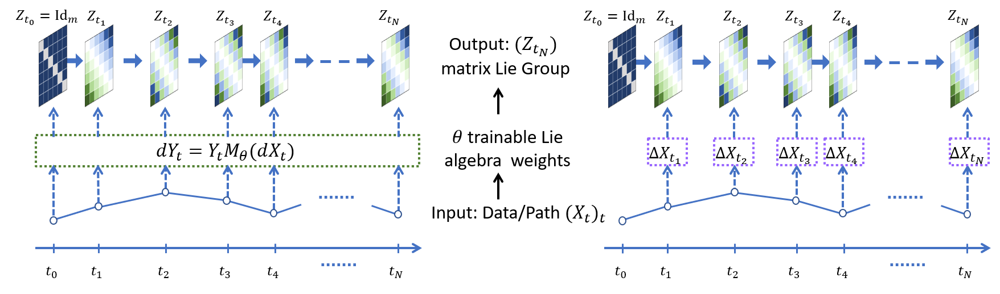

Path Development Network with Finite dimensional Lie Group Representation
========================================

<p align="center">

</p>

This repository is the official implementation  of the paper entitled "Path Development Network with Finite dimensional Lie Group"

## Environment Setup
The code has been tested successfully using Python 3.7; thus we suggest using this version or a later version of Python. A typical process for installing the package dependencies involves creating a new Python virtual environment.

To install the required packages, run the following:
```console
pip install .
```
## Example
The soruce code of the development network is in the [development](development) subdirectory. We currently provide the implementations for five Lie groups: Special Othorgonal, Real Symplectic, Special Euclidean, Unitary and group of orientation-preserving isometries of the hyperbolic space. 

The development layer can be used like standard RNN type models on the time series. For demonstrations, we provide a self contained short example:

```python
from development.nn import development_layer
from development.sp import sp
from development.hyperbolic import hyperbolic
from development.se import se
from development.so import so
import torch

# Create some data
batch, length, input_size = 1, 10, 2
hidden_size = 3
x = torch.rand(batch, length, input_size)

# specify the Lie algebra
param = so  # sp, hyperbolic, se,


# Development layer can directly apply on x like standard RNN model
# Specify development layer with the weigths

dev = development_layer(
    input_size=input_size, hidden_size=hidden_size, param=param, return_sequence=False)
out = dev(x)
```  
## Reproducing experiments

The code for reproducing the experiments of the paper can be found in the subdirectories: [SpeechCommands](SpeechCommands), [CharTrajectories](CharTrajecotries),[sMNIST](sMNIST),[CIFAR10](CIFAR10),[BM_2Sphere](BM_2Sphere) and [Nbody](Nbody). Each experiment contains a simple run script to generate data, train and evaluate models. For the first time user, it will takes some time to generate the dataset automatically. See the following instructions for each specific task.

### Speech Commands
To train individual model with our hyperparameter using the [SpeechCommands/run.py](SpeechCommands/run.py) script. This script takes one argument to specify the model, i.e.
```console
python3 SpeechCommands/run.py --model MODEL_NAME
```
where `MODEL_NAME` is either `DEV`, `signature`, `LSTM`, `LSTM_DEV`.

To run all experiments in the paper at once, where each model is ran over five iterations:
```console
python3 SpeechCommands/run_all.py
```

### Charactore Trajectories
To train a individual model with our hyperparameter using the [CharTrajectories/run.py](CharTrajectories/run.py) script. This script takes three arguments, i.e.

```console
python3 CharTrajectories/run.py --model MODEL_NAME --param LIE_GROUP --drop_rate DROP_RATE --train_sr TRAIN_SAMPLE_RATE -- --test_sr TEST_SAMPLE_RATE
```
where `MODEL_NAME` is either `DEV`, `signature`, `LSTM`, `LSTM_DEV`,`EXPRNN`.`LIE_GROUP` is either `SO` or `Sp`. `DROP_RATE` can take value in `[0.3,0.5,0.7]`,`SAMPLE_RATE` can take value in `[1,0.5]` . 

To run all experiments in the paper at once, where each model is ran over five iterations:
```console
python3 CharTrajectories/run_all.py
```
The plots for this experiment in the paper can be found in the notebook [CharTrajectories/notebooks/plot_loss.ipynb](CharTrajectories/notebooks/plot_loss.ipynb)

### Sequential MNIST & Permuted MNIST
To train individual model with our hyperparameter using the [sMNIST/run.py](sMNIST/run.py) script. This script takes two auguments, i.e.

```console
python3 sMNIST/run.py --model MODEL_NAME --permuted PERMUTED
```
where `MODEL_NAME` is either `LSTM`, `LSTM_DEV`.`PERMUTED` is either `True` or `False`.

### Sequential CIFAR10
To train individual model with our hyperparameter using the [CIFAR10/run.py](CIFAR10/run.py) script. This script takes one model augument, i.e.

```console
python3 CIFAT10/run.py --model MODEL_NAME
```
where `MODEL_NAME` is either `LSTM`, `LSTM_DEV`,`EXPRNN`.

### Brownian Motion on 2Sphere
To train individual model with our hyperparameter using the [BM_2Sphere/run.py](BM_2Sphere/run.py) script. This script takes three auguments, i.e.

```console
python3 BM_2Sphere/run.py --model MODEL_NAME  
```
where `MODEL_NAME` is either `LSTM_DEV`, `EXPRNN`, `LSTM`

The visualization for this experiment in the paper can be found in the notebook [BM_2Sphere/notebooks/2sphere.ipynb](BM_2Sphere/notebooks/2sphere.ipynb)
### N-body Simulation
To train individual model with our hyperparameter using the [Nbody/run.py](Nbody/run.py) script. This script takes three auguments, i.e.

```console
python3 Nbody/run.py --model MODEL_NAME --param LIE_GROUP --p PREDICTION_STEPs 
```
where `MODEL_NAME` is either `LSTM`, `LSTM_DEV`.`LIE_GROUP` is either `SO` or `SE`. `PREDICTION_STEPs` can take value in `[10,30,50]`. 

To run all experiments in the paper at once,  where each model is ran over five iterations:
```console
python3 Nbody/run_all.py
```
The visualization for this experiment in the paper can be found in the notebook [Nbody/notebooks/visualization.ipynb](Nbody/notebooks/visualization.ipynb)

